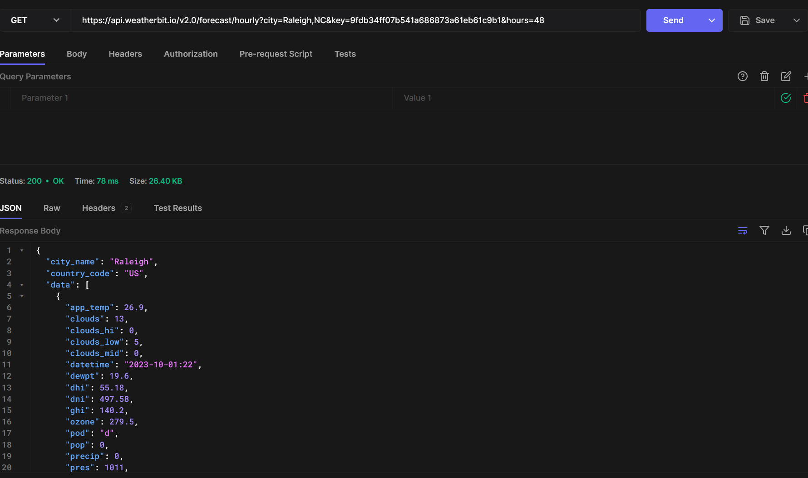

# CSC207-Group-Project
A lovely dating planner.  
This application will help the user to plan for their date.  
The user should be able to input a calendar date and specifications such as time (having lunch together) or preferences (crafty activities vs. athletic ones vs. educational ones etc.).  
This application will provide the following features: weather considerations, restaurant and activity suggestions, as well as maps/transit and estimated costs.

# APIs

Weather - http://api.weatherbit.io/v2.0/forecast/hourly  
Calendar - https://www.googleapis.com/calendar/v3/calendars/calendarId  
Restaurants- [link]  
Map - [link]  
TicketMaster - https://app.ticketmaster.com/discovery/v2/events  
Reviews - https://reviewapi.com/  
Google Search - https://apilayer.com/marketplace/google_search-api

# API Documentation

Weather - https://www.weatherbit.io/api/weather-forecast-hourly  
Calendar - https://developers.google.com/calendar/api/guides/overview  
Restaurants - [link]  
Cinemas - [link]  
Map - [link]  
TicketMaster - https://developer.ticketmaster.com/products-and-docs/apis/discovery-api/v2/#search-events-v2  
Reviews - https://reviewapi.com/  
Google Search - https://apilayer.com/marketplace/google_search-api

# API results from Hoppscotch.io
TicketMaster

Weatherbit

# Technical Problems
None so far
